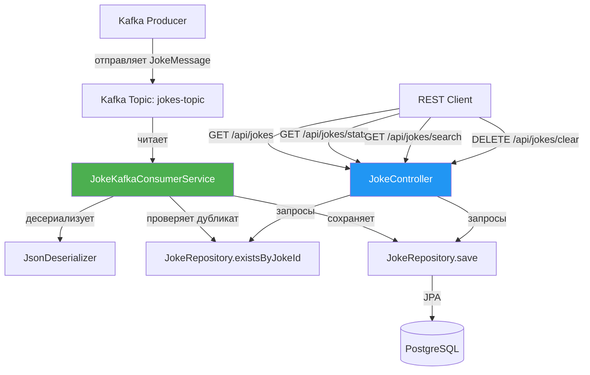
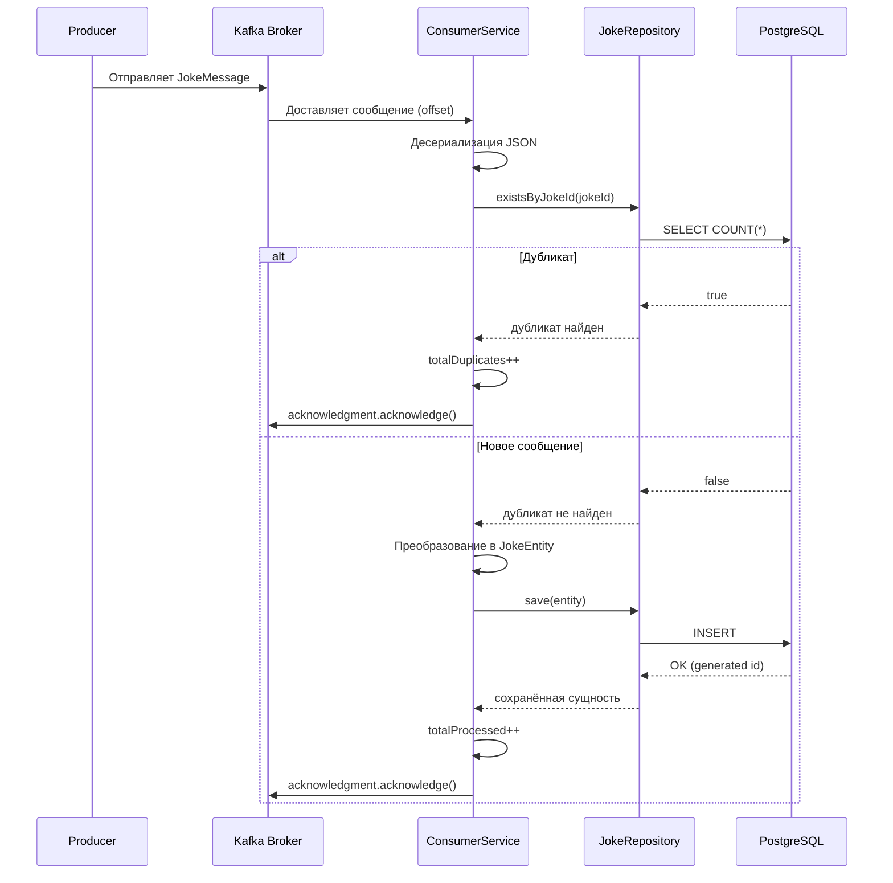
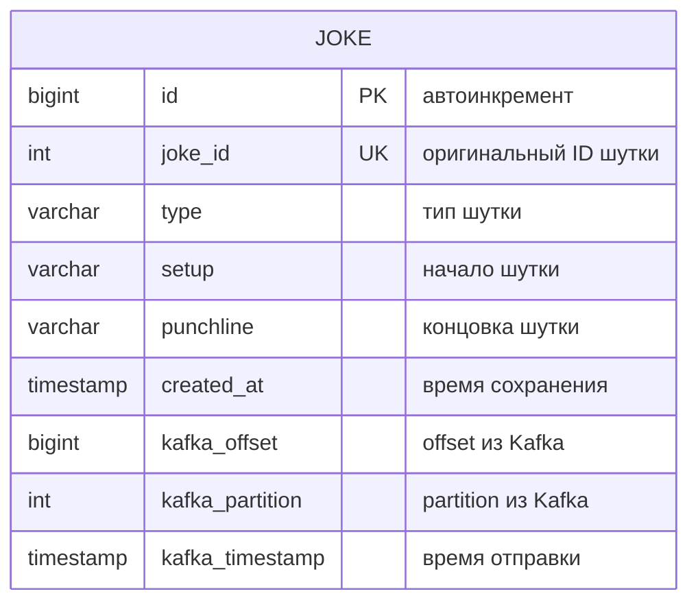

# Joke-consumer


[](./README.md)
[](./README.ru.md)

---


# 🃏 Joke Kafka Consumer

Сервис-потребитель для асинхронного приёма шуток из Apache Kafka, их сохранения в PostgreSQL и предоставления через REST API с расширенной статистикой.

---

## 📌 Оглавление

1. [Описание проекта](#описание-проекта)
2. [Архитектура и компоненты](#архитектура-и-компоненты)
   - [Диаграмма компонентов](#диаграмма-компонентов)
   - [Диаграмма последовательности](#диаграмма-последовательности)
   - [ER-диаграмма](#er-диаграмма)
3. [Технологический стек](#технологический-стек)
4. [Структура проекта](#структура-проекта)
5. [Установка и запуск](#установка-и-запуск)
   - [Предварительные требования](#предварительные-требования)
   - [Настройка окружения (Docker Compose)](#настройка-окружения-docker-compose)
   - [Настройка приложения](#настройка-приложения)
   - [Сборка и запуск](#сборка-и-запуск)
6. [Конфигурация](#конфигурация)
   - [Kafka](#kafka)
   - [База данных](#база-данных)
   - [Логирование](#логирование)
7. [REST API](#rest-api)
   - [Получить все шутки (с пагинацией)](#получить-все-шутки-с-пагинацией)
   - [Получить последние 10 шуток](#получить-последние-10-шуток)
   - [Статистика](#статистика)
   - [Поиск по ключевому слову](#поиск-по-ключевому-слову)
   - [Очистка БД](#очистка-бд)
   - [Тестовое сохранение](#тестовое-сохранение)
8. [Особенности реализации](#особенности-реализации)
   - [Обработка дубликатов](#обработка-дубликатов)
   - [Ручное подтверждение offset](#ручное-подтверждение-offset)
   - [Обработка ошибок](#обработка-ошибок)
   - [Транзакционность](#транзакционность)
9. [Тестирование](#тестирование)
   - [Модульные тесты](#модульные-тесты)
   - [Интеграционные тесты](#интеграционные-тесты)
   - [Ручное тестирование Kafka](#ручное-тестирование-kafka)
10. [Примеры работы](#примеры-работы)
11. [Возможные проблемы и решения](#возможные-проблемы-и-решения)
12. [Планы по развитию](#планы-по-развитию)
13. [Лицензия](#лицензия)

---

## 📖 
### Описание проекта

**Joke Kafka Consumer** — это Spring Boot микросервис, который:

- **Подписывается** на топик Kafka `jokes-topic`.
- **Получает** сообщения с шутками в формате JSON (структура: `id`, `type`, `setup`, `punchline`).
- **Дедуплицирует** сообщения по полю `id` (пропускает уже сохранённые).
- **Сохраняет** шутки в PostgreSQL с метаданными Kafka (partition, offset, timestamp).
- **Предоставляет REST API** для доступа к сохранённым шуткам, поиска, статистики и управления.

Проект демонстрирует **production-ready** подход к асинхронной обработке сообщений с ручным управлением offset, обработкой ошибок и дедупликацией.

---

## 🧱 
### Архитектура и компоненты

### Диаграмма компонентов


### Диаграмма последовательности (обработка сообщения)

### ER-диаграмма

### 🔧 
### Технологический стек

|Компонент|	Технология|
|---------------|----------------------|
|Фреймворк|	Spring Boot 3.2.x|
|Обмен сообщениями|	Apache Kafka (Spring Kafka)|
|База данных|	PostgreSQL 15+ (или H2 для тестов)|
|ORM	|Spring Data JPA (Hibernate 6)|
|Сборка	|Maven|
|Язык|	Java 17+|
|Десериализация|	Jackson (JsonDeserializer)|
|Ломбок	|Project Lombok|
|Тестирование|	JUnit 5, Mockito, Testcontainers|
|Мониторинг	|Spring Boot Actuator|
|Логирование|	SLF4J + Logback|

## 📂 
## Структура проекта
```bach
joke-kafka-consumer/
├── src/
│   ├── main/
│   │   ├── java/
│   │   │   └── com/example/jokekafkaconsumer/
│   │   │       ├── JokeKafkaConsumerApplication.java  # Точка входа
│   │   │       ├── config/
│   │   │       │   └── KafkaConsumerConfig.java       # Настройка Kafka
│   │   │       ├── controller/
│   │   │       │   └── JokeController.java            # REST API
│   │   │       ├── dto/
│   │   │       │   └── JokeMessage.java               # DTO для Kafka
│   │   │       ├── model/
│   │   │       │   └── JokeEntity.java                # JPA-сущность
│   │   │       ├── repository/
│   │   │       │   └── JokeRepository.java            # JPA-репозиторий
│   │   │       └── service/
│   │   │           └── JokeKafkaConsumerService.java  # Kafka-потребитель
│   │   └── resources/
│   │       ├── application.properties                 # Основные настройки
│   │       ├── static/
│   │       └── templates/
│   └── test/                                          # Тесты (опционально)
├── .gitattributes
├── .gitignore
├── HELP.md
├── LICENSE
├── mvnw
├── mvnw.cmd
└── pom.xml
```
## 🚀 
## Установка и запуск

### Предварительные требования

   * JDK 17 или новее (скачать)

   * Apache Kafka (локально или через Docker)

   * PostgreSQL 15+ (локально или через Docker)

   * Maven (или использовать встроенный mvnw)

   * Docker и Docker Compose (рекомендуется для быстрого старта)

### Настройка окружения (Docker Compose)
#### Создайте файл docker-compose.yml в корне проекта:
```bach
version: '3.8'

services:
  zookeeper:
    image: confluentinc/cp-zookeeper:latest
    container_name: zookeeper
    environment:
      ZOOKEEPER_CLIENT_PORT: 2181
      ZOOKEEPER_TICK_TIME: 2000
    ports:
      - "2181:2181"

  kafka:
    image: confluentinc/cp-kafka:latest
    container_name: kafka
    depends_on:
      - zookeeper
    environment:
      KAFKA_BROKER_ID: 1
      KAFKA_ZOOKEEPER_CONNECT: zookeeper:2181
      KAFKA_ADVERTISED_LISTENERS: PLAINTEXT://localhost:9092
      KAFKA_OFFSETS_TOPIC_REPLICATION_FACTOR: 1
      KAFKA_TRANSACTION_STATE_LOG_MIN_ISR: 1
      KAFKA_TRANSACTION_STATE_LOG_REPLICATION_FACTOR: 1
    ports:
      - "9092:9092"

  postgres:
    image: postgres:15
    container_name: postgres
    environment:
      POSTGRES_DB: jokes_db
      POSTGRES_USER: postgres
      POSTGRES_PASSWORD: 12345
    ports:
      - "5432:5432"
    volumes:
      - postgres_data:/var/lib/postgresql/data

volumes:
  postgres_data:
```
### Запустите все сервисы:
```bach
docker-compose up -d
```
#### Проверьте, что всё работает:
```bach
docker ps
```
### Настройка приложения
#### Файл src/main/resources/application.properties:
```bach
#properties
# ===== Сервер =====
server.port=8081

# ===== KAFKA =====
spring.kafka.bootstrap-servers=localhost:9092
spring.kafka.consumer.group-id=joke-consumer-group
spring.kafka.consumer.auto-offset-reset=earliest
spring.kafka.consumer.enable-auto-commit=false
spring.kafka.consumer.key-deserializer=org.apache.kafka.common.serialization.StringDeserializer
spring.kafka.consumer.value-deserializer=org.springframework.kafka.support.serializer.JsonDeserializer
spring.kafka.consumer.properties.spring.json.trusted.packages=*
spring.kafka.consumer.properties.spring.json.value.default.type=com.example.jokekafkaconsumer.dto.JokeMessage
spring.kafka.listener.ack-mode=manual
spring.kafka.listener.concurrency=1
spring.kafka.listener.poll-timeout=3000

# ===== POSTGRESQL =====
spring.datasource.url=jdbc:postgresql://localhost:5432/jokes_db
spring.datasource.username=postgres
spring.datasource.password=12345
spring.datasource.driver-class-name=org.postgresql.Driver
spring.datasource.hikari.maximum-pool-size=5

# ===== JPA =====
spring.jpa.hibernate.ddl-auto=update
spring.jpa.show-sql=true
spring.jpa.properties.hibernate.format_sql=true

# ===== ЛОГИРОВАНИЕ =====
logging.level.com.example.jokekafkaconsumer=DEBUG
logging.level.org.springframework.kafka=INFO
logging.level.org.apache.kafka.clients.consumer=INFO
logging.level.org.hibernate.SQL=DEBUG
logging.level.org.hibernate.orm.jdbc.bind=TRACE

# ===== ACTUATOR =====
management.endpoints.web.exposure.include=health,info,metrics
```
### Сборка и запуск

```bach
# Клонируйте репозиторий
git clone https://github.com/your-username/joke-kafka-consumer.git
cd joke-kafka-consumer

# Сборка проекта
./mvnw clean package

# Запуск приложения
./mvnw spring-boot:run
```
#### Приложение будет доступно по адресу: http://localhost:8081

## ⚙️ 
## Конфигурация
|Свойство	|Значение	|Описание|
|--------------------|-----------------|------------------------|
|spring.kafka.bootstrap-servers|	localhost:9092|	Адрес брокера Kafka|
|spring.kafka.consumer.group-id	|joke-consumer-group	|ID группы потребителей|
|spring.kafka.consumer.auto-offset-reset	|earliest|	Читать с самого начала|
|spring.kafka.consumer.enable-auto-commit|	false|	Важно! Ручное управление offset|
|spring.kafka.listener.ack-mode	|manual	|Подтверждение вручную|
|spring.kafka.listener.concurrency|1	|Количество потоков-слушателей|

## База данных

|Свойство	|Значение	|Описание|
|-------------------|--------------|--------------------|
spring.datasource.url|	jdbc:postgresql://localhost:5432/jokes_db|	JDBC URL|
spring.datasource.username	|postgres	|Имя пользователя|
spring.datasource.password|	12345	|Пароль|
spring.jpa.hibernate.ddl-auto	|update	|Автосоздание/обновление схемы|

## Логирование
|Логгер	|Уровень|	Описание|
|-------------------|---------------|---------------|
|com.example.jokekafkaconsumer	|DEBUG	|Логи приложения|
|org.springframework.kafka|	INFO	|Логи Kafka|
|org.hibernate.SQL|	DEBUG	|SQL-запросы|
|org.hibernate.orm.jdbc.bind|	TRACE	|Параметры запросов|

## 🌐 
## REST API


